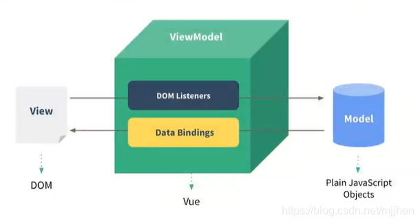
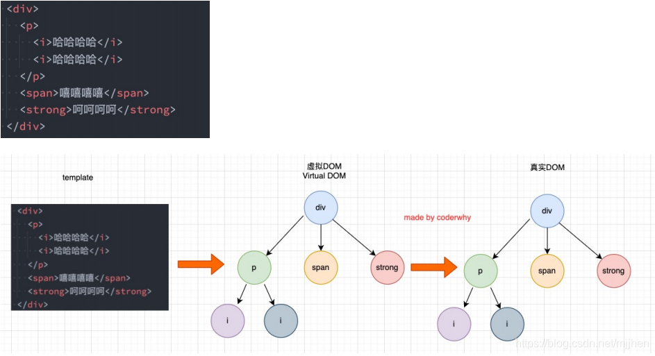
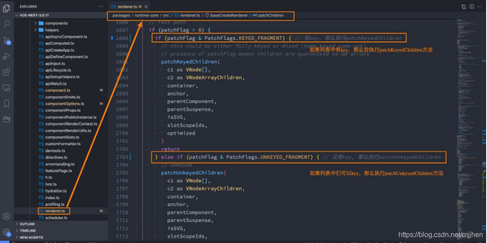
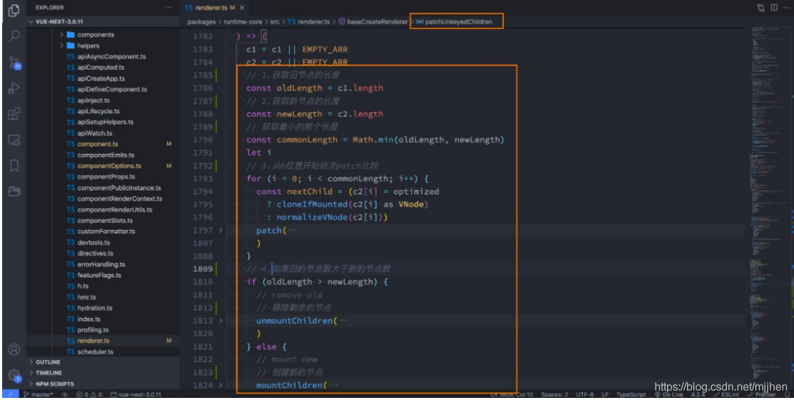
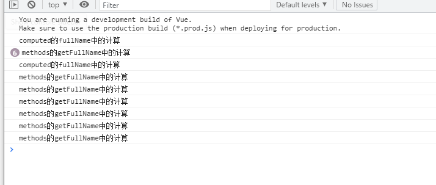

#  深入Vue3+TypeScropt技术栈

## 邂逅Vue3开发

### 认识Vue

- vue同view

- 渐进式：把vue作为你应用的一部分嵌入其总

- 目前Vue在前端处在什么地位？

  - 目前前端最主流的三大框架：Vue、React、Angular

    


### 如何引入Vue

1. CDN引入

   - CDN 称之为内容分发网络( Content Delivery Network或 Content Distribution Network,缩写:CDN)

     - 它是指通过相互连接的网络系统,利用最靠近每个用户的服务器;
     - 更快、更可靠地将音乐、图片、视频、应用程序及其他文件发送给用户;
     - 来提供高性能、可扩展性及低成本的网络内容传递给用户;

   - 代码：

     ```html
     <body>
       <div id="app"></div>
     
       <script src="https://unpkg.com/vue@next"></script>
       <script>
         const mjjh = {
           template: '<h2>Hellow World</h2>'
         }
         const app = Vue.createApp(mjjh);
         app.mount("#app")
       </script>
     </body>
     ```

2. local引入

   - 下载后直接引入

   - 代码：

     ```html
     <body>
       <div id="app"></div>
     
       <script src="../js//Vue.js"></script>
       <script>
         const app = Vue.createApp({
           template: '<h2>Hellow World</h2>'
         }).mount("#app")
       </script>
     </body>
     ```

### Vue初识-计数器案例

- js原生

  ```html
  <body>
    <h2 class="counter"></h2>
    <button class="increment">+1</button>
    <button class="decrement">-1</button>
    <script>
      const conterEl = document.querySelector('.counter')
      const incrementEl = document.querySelector('.increment')
      const decrementEl = document.querySelector('.decrement')
  
      let counter = 100;
      conterEl.innerHTML = counter;
  
      incrementEl.addEventListener("click",() =>{
        counter += 1;
        conterEl.innerHTML = counter
      })
      decrementEl.addEventListener("click",() =>{
        counter -= 1;
        conterEl.innerHTML = counter
      })
  
    </script>
  </body>
  ```

- Vue

  ```html
  <body>
    <div id="app"></div>
    <script src="../js//Vue.js"></script>
    <script>
      Vue.createApp({
        template: `
        <div>
          <h2>{{message}}</h2>
          <h2>{{counter}}</h2>
          <button @click='increment'>+1</button>
          <button @click='decrement'>-1</button>
        </div>
        `,
        data: function(){
          return{
            message:"Hello World",
            counter: 100
          }
        },
        methods: {
          increment(){
            this.counter++
          },
          decrement(){
            this.counter--
          }
        }
      }).mount("#app")
    </script>
  </body>
  ```

### 声明式编程和命令式编程

- 原生开发和Vue开发的模式和特点,我们会发现是完全不同的,这里其实涉及到两种不同的编程范式命令式编程和声明式编程
- 命令式编程关注的是“ how to do”,声明式编程关注的是" what to do",由框架(机器)完成"how"的过程

### MVVM模型

- MVC和MVVM都是一种软件的体系结构
  - MVC是 Model-View-Controller的简称,是在前期被使用非常框架的架构模式,比如iS、前端
  - MVVM是 Model-View- ViewMode的简称,是目前非常流行的架构模式
- 通常情况下,我们也经常称vue是一个MVVM的框架

vue官方其实有说明,vue虽然并没有完全遵守MVVM的模型,但是整个设计是受到它的启发的



### template属性

- 在使用 createApp的时候,我们传入了一个对象,接下来我们详细解析一下之前传入的属性分别代表什么含义。

- template属性:表示的是Vue需要帮助我们渲染的模板信息

  - 目前我们看到它里面有很多的HTML标签,这些标签会替换掉我们挂载到的元素(比如id为app的dⅳv)的innerHTML
  - 模板中有一些奇怪的语法,比如{},比如@ )click,这些都是模板特有的语法,我们会在后面讲到

- 但是这个模板的写法有点过于别扭了,并且IDE很有可能没有任何提示,阻碍我们编程的效率

- vue提供了两种方式:

  - 方式一:使用 script标签,并且标记它的类型为 X-template;

    ```html
    <body>
      <div id="app">hhhh</div>
    
      <script type="x-template" id="why">
        <div>
          <h2>{{message}}</h2>
          <h2>{{counter}}</h2>
          <button @click='increment'>+1</button>
          <button @click='decrement'>-1</button>
        </div>
      </script>
    
      <script src="../js//Vue.js"></script>
      <script>
        Vue.createApp({
          template: '#why',
          data: function(){
            return{
              message:"Hello World",
              counter: 100
            }
          },
          methods: {
            increment(){
              this.counter++
            },
            decrement(){
              this.counter--
            }
          }
        }).mount("#app")
      </script>
    </body>
    ```

  - 方式二:使用任意标签(通常使用 template标签,因为不会被浏览器渲染),设置id;v template元素是一种用于保存客户端内容的机制,该内容再加载页面时不会被呈现,但随后可以在运行时使用 JavaScript实例化

    ```html
    <body>
      <div id="app"></div>
      <template id="why">
        <div>
          <h2>{{message}}</h2>
          <h2>{{counter}}</h2>
          <button @click='increment'>+1</button>
          <button @click='decrement'>-1</button>
        </div>
      </template>
    
      <script src="../js//Vue.js"></script>
      <script>
        Vue.createApp({
          template: '#why',
          data: function(){
            return{
              message:"Hello World",
              counter: 100
            }
          },
          methods: {
            increment(){
              this.counter++
            },
            decrement(){
              this.counter--
            }
          }
        }).mount("#app")
      </script>
    </body>
    ```

    - 没用的小知识：也可使用div等盒子，但是div会被浏览器加载，所以会显示两个

### data属性

- data属性是传入一个函数,并且该函数需要返回一个对象
  - 在Vue2x的时候,也可以传入一个对象(虽然官方推荐是一个函数);
  - **在Vue3x的时候,必须传入一个函数,否则就会直接在浏览器中报错**
- data中返回的对象会被vue的响应式系统劫持,之后对该对象的修改或者访问都会在劫持中被处理
  - 所以我们在 template中通过{ counter}访问 counter,可以从对象中获取到数据
  - 所以我们修改 counter的值时, template中的{ counter)也会发生改变;

### methods属性（重点）

- methods属性是一个对象,通常我们会在这个对象中定义很多的方法

  - 这些方法可以被绑定到 template模板中;
  - 在该方法中,我们可以使用this关键字来直接访问到data中返回的对象的属性;

- 问题：官方文档有这个描述，即不能使用箭头函数

  

- **为什么不能使用箭头函数(VUE3.0)？**

  - 我们在methods中要使用data返回对象中的数据：
    - 那么这个this是必须有值的，并且应该可以通过this获取到data返回对象中的数据。
  - 那么我们这个this能不能是window呢？
    - 不可以是window，因为window中我们无法获取到data返回对象中的数据；
    - 但是如果我们使用箭头函数，那么这个this就会是window了；
  - 为什么是window呢？
    - 这里涉及到箭头函数使用this的查找规则，它会在自己的上层作用于中来查找this；
    - 最终刚好找到的是script作用于中的this，所以就是window；
  - this到底是如何查找和绑定的呢？
    - https://mp.weixin.qq.com/s/hYm0JgBI25grNG_2sCRlTA

- **不使用箭头函数的情况下，this到底指向什么**

  - 事实上Vue的源码当中就是对methods中的所有函数进行了遍历，并且通过bind绑定了this

    

### 如何阅读Vue源码

- 需要的环境 npm，yarn
- 操作步骤
  1. 安装yarn npm install yarn -g
  2. 在项目中配置yarn yarn install
  3. 在package.json中的dev后加上--sourcemap
  4. 打包项目 yarn dev （在vue/dist文件夹下有两个文件，vue.global.js和vue.global.js.map）
  5. 在vue/examplex新建自己的文件夹以及测试demo
  6. 在demo中打下断点—**debugger**
  7. 在浏览器中打开调试面板，选择其中的source面板，查看执行对应的源码

##  Vue基础-模板语法

### vs-code代码片段

- 设置-用户代码片段-选择语言
- 将需要的代码片段拷贝到https://snippet-generator.app网站下，并且填写完Description，和Tab trigger后，拷贝到vs-code即可

### 模板语法

- React的开发模式
  - React使用的jsx,所以对应的代码都是编写的类似于js的一种语法
  - 之后通过Babe将js编译成 React. create Element函数调用
- vue也支持jsx的开发模式(后续有时间也会讲到):
  - 但是大多数情况下,使用基于HTML的模板语法
  - 在模板中,允许开发者以声明式的方式将DOM和底层组件实例的数据绑定在-起;口在底层的实现中,vue将模板编译成虚拟DOM渲染函数,这个我会在后续给大家讲到;

### mustache的使用

- 基本使用

  ```html
  <h2>{{message}}</h2>
  ```

- 表达式

  ```html
  <h2>{{message*10}}</h2>
  ```

- 函数

  ```html
  <h2>{{message.split(" ").reverse()join(" ")}}</h2>
  ```

- 三元运算符

  ```html
  <h2>{{isShow ? "hhhh":""}}</h2>
  ```

### 不常用指令

- v-once指令

  - v-once用于指定元素或者组件只渲染一次

    - 当数据发生变化时,元素或者组件以及其所有的子元素将视为静态内容并且跳过;

    - 该指令可以用于性能优化;

      ```html
      <h2 v-once>{{counter}}</h2>
      <button @click="increment">+1</button>
      ```

  - 如果是子节点的化，也只能渲染一次

    ```html
    <div v-once>
        <h2>{{counter}}</h2>
        <h2>{{message}}</h2>
    </div>
    <button @click="increment">+1</button>
    ```

- v-text

  - 用于更新元素的 textContent

    ```html
    <h2 v-text="message"></h2>
    <!-- 等价于 -->
    <h2>{{message}}</h2>
    ```

- v-html

  - 默认情况下，如果我们展示的内容本身是 html 的，那么vue并不会对其进行特殊的解析。

    - 如果我们希望这个内容被Vue可以解析出来，那么可以使用 v-html 来展示

      ```html
      <template id="my-app">
          <div>{{msg}}</div>
          <div v-html="msg"></div>
      </template>
      
      <script>
          const App = {
              template: '#my-app',
              data() {
                  return {
                      msg: '<span style="color:red; background: blue;">哈哈哈</span>'
                  }
              }
          }
      </script>
      ```

- v-pre

  - v-pre用于跳过元素和它的子元素的编译过程，显示原始的Mustache标签：

    - 跳过不需要编译的节点，加快编译的速度

      ```html
      <template id="my-app">
          <h2 v-pre>{{message}}</h2>
      </template>
      ```

- v-cloak

  - 这个指令保持在元素上直到关联组件实例结束编译。

    - 和 CSS 规则如 [v-cloak] { display: none } 一起用时，这个指令可以隐藏未编译的 Mustache 标签直到组件实例准备完毕

      ```html
      <template id="my-app">
          <h2 v-cloak>{{message}}</h2>
      </template>
      
      <script>
          const App = {
            template: '#my-app',
            data() {
              return {
                message: "Hello World"
              }
            }
          }
      </script>
      ```

    - 不会显示，直到编译结束

### v-bind

- v-bind的绑定属性

  - 有用的小知识Vue3支持多个根元素
  - 前端讲的一系列指令，主要是将值插入到模板内容中。
  - 但是，除了内容需要动态来决定外，某些属性我们也希望动态来绑定。
    - 比如动态绑定a元素的href属性；
    - 比如动态绑定img元素的src属性；
  - 绑定属性我们使用v-bind：
  - 缩写：:
  - 预期：any (with argument) | Object (without argument)
  - 参数：attrOrProp (optional)
  - 修饰符：
    - .camel - 将 kebab-case attribute 名转换为 camelCase。
  - 用法：动态地绑定一个或多个 attribute，或一个组件 prop 到表达式。

- v-bind绑定基本属性

  - v-bind用于绑定一个或多个属性值，或者向另一个组件传递props值（这个学到组件时再介绍）；

  - 在开发中，有哪些属性需要动态进行绑定呢？

    - 还是有很多的，比如图片的链接src、网站的链接href、动态绑定一些类、样式等等

  - v-bind有一个对应的语法糖（:），也就是简写方式。

  - 在开发中，我们通常会使用语法糖的形式，因 为这样更加简洁

    ```html
    <template id="my-app">
        <!-- 1.v-bind的基本使用 -->
        
        <a v-bind:href="link">百度一下</a>
    
        <!-- 2.v-bind提供一个语法糖 : -->
        
        
    </template>
    ```

- v-bind绑定class

  - 在开发中,有时候我们的元素 class也是动态的,比如
    - 当数据为某个状态时,字体显示红色。
    - 当数据另一个状态时,字体显示黑色
  - 绑定class有两种方式：
    - 对象语法
    - 数组语法

- 绑定class-对象语法

  - 对象语法：我们可以传给 :class (v-bind:class 的简写) 一个对象，以动态地切换 class

    ```html
        <template id="my-app">
          <div :class="className">哈哈哈哈</div>
          <!-- 对象语法: {'active': boolean} -->
          <div :class="{'active': isActive}">呵呵呵呵</div>
          <button @click="toggle">切换</button>
    
          <!-- 也可以有多个键值对 -->
          <div :class="{active: isActive, title: true}">呵呵呵呵</div>
    
          <!-- 默认的class和动态的class结合 -->
          <div class="abc cba" :class="{active: isActive, title: true}">
            呵呵呵呵
          </div>
    
          <!-- 将对象放到一个单独的属性中 -->
          <div class="abc cba" :class="classObj">呵呵呵呵</div>
    
          <!-- 将返回的对象放到一个methods(computed)方法中 -->
          <div class="abc cba" :class="getClassObj()">呵呵呵呵</div>      
        </template>
    
        <script src="../js/vue.js"></script>
        <script>
          const App = {
            template: "#my-app",
            data() {
              return {
                className: "why",
                isActive: true,
                title: "abc",
                classObj: { 
                  active: true, 
                  title: true 
                },
              };
            },
            methods: {
              toggle() {
                this.isActive = !this.isActive;
              },
              getClassObj() {
                return { 
                  active: true, 
                  title: true 
                }
              }
            },
          };
    
          Vue.createApp(App).mount("#app");
        </script>
    ```

- 绑定class – 数组语法

  - 数组语法：我们可以把一个数组传给 :class，以应用一个 class 列表

    ```html
      <template id="my-app">
        <div :class="['abc', title]">哈哈哈哈</div>
        <div :class="['abc', title, isActive ? 'active': '']">哈哈哈哈</div>
        <div :class="['abc', title, {active: isActive}]">哈哈哈哈</div>
      </template>
    
      <script src="../js/vue.js"></script>
      <script>
        const App = {
          template: '#my-app',
          data() {
            return {
              message: "Hello World",
              title: "cba",
              isActive: true
            }
          }
        }
    
        Vue.createApp(App).mount('#app');
      </script>
    ```

- 绑定style介绍

  - 我们可以利用v-bind:style来绑定一些CSS内联样式
    - 这次因为某些样式我们需要根据数据动态来决定
    - 比如某段文字的颜色，大小等等
  - CSS property 名可以用驼峰式 (camelCase) 或短横线分隔 (kebab-case，记得用引号括起来) 来命名
  - 绑定class有两种方式
    - 对象语法
    - 数组语法

- 绑定style演练

  - 对象语法

    ```html
    <template id="my-app">
        <!-- :style="{cssPropertyName: cssPropertyValue}" -->
        <div :style="{color: finalColor, 'font-size': '30px'}">哈哈哈哈</div>
        <div :style="{color: finalColor, fontSize: '30px'}">哈哈哈哈</div>
        <div :style="{color: finalColor, fontSize: finalFontSize + 'px'}">哈哈哈哈</div>
    
        <!-- 绑定一个data中的属性值, 并且是一个对象 -->
        <div :style="finalStyleObj">呵呵呵呵</div>
        <!-- 调用一个方法 -->
        <div :style="getFinalStyleObj()">呵呵呵呵</div>
    </template>
    ```

  - 数组语法

    - style 的数组语法可以将多个样式对象应用到同一个元素上

      ```html
      <template id="my-app">
          <div :style="[style1Obj, style2Obj]">哈哈哈</div>
          
          <a :href=""></a>
          <div :class></div>
      </template>
      ```

- 动态绑定属性

  - 在某些情况下，我们属性的名称可能也不是固定的

    - 前端我们无论绑定src、href、class、style，属性名称都是固定的

    - 如果属性名称不是固定的，我们可以使用 :[属性名]=“值” 的格式来定义

    - 这种绑定的方式，我们称之为动态绑定属性；

      ```html
      <template id="my-app">
          <div :[name]="value">哈哈哈</div>
      </template>
      ```

- 绑定一个对象

  - 如果我们希望将一个对象的所有属性，绑定到元素上的所有属性，应该怎么做呢？

    - 非常简单，我们可以直接使用 v-bind 绑定一个 对象

  - 案例：info对象会被拆解成div的各个属性

    ```html
    <template id="my-app">
        <div v-bind="info">哈哈哈哈</div>
        <div :="info">哈哈哈哈</div>
    </template>
    ```

### v-on

- v-on绑定事件

  - 前面我们绑定了元素的内容和属性，在前端开发中另外一个非常重要的特性就是交互。
  - 在前端开发中，我们需要经常和用户进行各种各样的交互
    - 这个时候，我们就必须监听用户发生的事件，比如点击、拖拽、键盘事件等等
    - 在Vue中如何监听事件呢？使用v-on指令。

- v-on的用法

  - 缩写：@
  - 预期：Function | Inline Statement | Object
  - 参数：event p 修饰符：
    - .stop - 调用 event.stopPropagation()。
    - .prevent - 调用 event.preventDefault()。
    - .capture - 添加事件侦听器时使用 capture 模式。
    - .self - 只当事件是从侦听器绑定的元素本身触发时才触发回调。
    - .{keyAlias} - 仅当事件是从特定键触发时才触发回调。
    - .once - 只触发一次回调。
    - .left - 只当点击鼠标左键时触发。
    - .right - 只当点击鼠标右键时触发。
    - .middle - 只当点击鼠标中键时触发。
    - .passive - { passive: true } 模式添加侦听器
  - 用法：绑定事件监听

- v-on的基本使用

  ```html
  <template id="my-app">
      <!-- 完整写法: v-on:监听的事件="methods中方法" -->
      <button v-on:click="btn1Click">按钮1</button>
      <div class="area" v-on:mousemove="mouseMove">div</div>
      <!-- 语法糖 -->
      <button @click="btn1Click">按钮1</button>
      <!-- 绑定一个表达式: inline statement -->
      <button @click="counter++">{{counter}}</button>
      <!-- 绑定一个对象 -->
      <div class="area" v-on="{click: btn1Click, mousemove: mouseMove}"></div>
      <div class="area" @="{click: btn1Click, mousemove: mouseMove}"></div>
  </template>
  ```

- v-on参数传递

  - 当通过methods中定义方法，以供@click调用时，需要注意参数问题：

  - 情况一：如果该方法不需要额外参数，那么方法后的()可以不添加。

    - 但是注意：如果方法本身中有一个参数，那么会默认将原生事件event参数传递进去

  - 情况二：如果需要同时传入某个参数，同时需要event时，可以通过$event传入事件。

    ```html
    <template id="my-app">
        <!-- 默认传入event对象, 可以在方法中获取 -->
        <button @click="btn1Click">按钮1</button>
        <!-- $event可以获取到事件发生时的事件对象 -->
        <button @click="btn2Click($event, 'coderwhy', 18)">按钮2</button>
    </template>
    ```

- v-on的修饰符

  - v-on支持修饰符，修饰符相当于对事件进行了一些特殊的处理：

  - .stop - 调用 event.stopPropagation()。

  - .prevent - 调用 event.preventDefault()。

  - .capture - 添加事件侦听器时使用 capture 模式。

  - .self - 只当事件是从侦听器绑定的元素本身触发时才触发回调。

  - .{keyAlias} - 仅当事件是从特定键触发时才触发回调。

  - .once - 只触发一次回调。

  - .left - 只当点击鼠标左键时触发。

  - .right - 只当点击鼠标右键时触发。

  - .middle - 只当点击鼠标中键时触发。

  - .passive - { passive: true } 模式添加侦听器

    ```html
    <template id="my-app">
        <div @click="divClick">
        	<button @click.stop="btnClick">按钮</button>	
        </div>
        <input type="text" @keyup.enter="enterKeyup">
    </template>
    ```

### 条件渲染

- 在某些情况下，我们需要根据当前的条件决定某些元素或组件是否渲染，这个时候我们就需要进行条件判断了。

  - Vue提供了下面的指令来进行条件判断：
    - v-if
    - v-else
    - v-else-if
    - v-show

- v-if、v-else、v-else-if用于根据条件来渲染某一块的内容：

  - 这些内容只有在条件为true时，才会被渲染出来；

  - 这三个指令与JavaScript的条件语句if、else、else if类似；

    ```html
    <template id="my-app">
        <input type="text" v-model="score">
        <h2 v-if="score > 90">优秀</h2>
        <h2 v-else-if="score > 60">良好</h2>
        <h2 v-else>不及格</h2>
    </template>
    ```

- v-if的渲染原理：

  - v-if是惰性的；
  - 当条件为false时，其判断的内容完全不会被渲染或者会被销毁掉；
  - 当条件为true时，才会真正渲染条件块中的内容;

- template元素

  - 因为v-if是一个指令，所以必须将其添加到一个元素上：

    - 但是如果我们希望切换的是多个元素呢？
    - 此时我们渲染div，但是我们并不希望div这种元素被渲染； p
    - 这个时候，我们可以选择使用template；

  - template元素可以当做不可见的包裹元素，并且在v-if上使用，但是最终template不会被渲染出来：

    - 有点类似于小程序中的block

      ```html
      <template id="my-app">
          <template v-if="isShowHa">
              <h2>哈哈哈哈</h2>
              <h2>哈哈哈哈</h2>
              <h2>哈哈哈哈</h2>
          </template>
      
          <template v-else>
              <h2>呵呵呵呵</h2>
              <h2>呵呵呵呵</h2>
              <h2>呵呵呵呵</h2>
          </template>
      </template>
      ```

  - v-show

    - v-show和v-if的用法看起来是一致的，也是根据一个条件决定是否显示元素或者组件

      ```html
      <template id="my-app">
          <h2 v-show="isShow">哈哈哈哈</h2>
      </template>
      ```

  - v-show和v-if的区别

    - 首先，在用法上的区别：
      - v-show是不支持template；
      - v-show不可以和v-else一起使用；
    - 其次，本质的区别：
      - v-show元素无论是否需要显示到浏览器上，它的DOM实际都是有渲染的，只是通过CSS的display属性来进行 切换；
      - v-if当条件为false时，其对应的元素压根不会被渲染到DOM中；
    - 开发中如何进行选择呢？
      - 如果我们的元素需要在显示和隐藏之间频繁的切换，那么使用v-show；
      - 如果不会频繁的发生切换，那么使用v-if；

### 列表渲染

- 在真实开发中，我们往往会从服务器拿到一组数据，并且需要对其进行渲染。

  - 这个时候我们可以使用v-for来完成；
  - v-for类似于JavaScript的for循环，可以用于遍历一组数据；

- v-for基本使用

  - n v-for的基本格式是 "item in 数组"：

    - 数组通常是来自data或者prop，也可以是其他方式；
    - item是我们给每项元素起的一个别名，这个别名可以自定来定义；

  - 我们知道，在遍历一个数组的时候会经常需要拿到数组的索引：

    - 如果我们需要索引，可以使用格式： "(item, index) in 数组"；

    - 注意上面的顺序：数组元素项item是在前面的，索引项index是在后面的；

      ```html
      <template id="my-app">
          <h2>电影列表</h2>
          <ul>
            <!-- 遍历数组 -->
            <li v-for="(movie, index) in movies">{{index+1}}.{{movie}}</li>
          </ul>
          <h2>个人信息</h2>
          <ul>
            <!-- 遍历对象 -->
            <li v-for="(value, key, index) in info">{{value}}-{{key}}-{{index}}</li>
          </ul>
          <h2>遍历数字</h2>
          <ul>
            <li v-for="(num, index) in 10">{{num}}-{{index}}</li>
          </ul>
        </template>
      ```

- v-for支持的类型

  - v-for也支持遍历对象，并且支持有一二三个参数：
    - 一个参数： "value in object";
    - 二个参数： "(value, key) in object";
    - 三个参数： "(value, key, index) in object";
  - v-for同时也支持数字的遍历：
    - 每一个item都是一个数字；

- template元素

  - 类似于v-if，你可以使用 template 元素来循环渲染一段包含多个元素的内容：

    - 我们使用template来对多个元素进行包裹，而不是使用div来完成；

      ```html
      <template id="my-app">
          <ul>
            <template v-for="(value, key) in info">
              <li>{{key}}</li>
              <li>{{value}}</li>
              <li class="divider"></li>
            </template>
          </ul>
        </template>
      ```

- 数组更新检测

  - Vue 将被侦听的数组的变更方法进行了包裹，所以它们也将会触发视图更新。这些被包裹过的方法包括：

    - push()
    - pop()
    - shift()
    - unshift()
    - splice()
    - sort()
    - reverse()

  - 替换数组的方法

    - 上面的方法会直接修改原来的数组，但是某些方法不会替换原来的数组，而是会生成新的数组，比如 filter()、 concat() 和 slice()。

      ```html
       <template id="my-app">
          <h2>电影列表</h2>
          <ul>
            <li v-for="(movie, index) in movies">{{index+1}}.{{movie}}</li>
          </ul>
          <input type="text" v-model="newMovie">
          <button @click="addMovie">添加电影</button>
        </template>
      
        <script src="../js/vue.js"></script>
        <script>
          const App = {
            template: '#my-app',
            data() {
              return {
                newMovie: "",
                movies: [
                  "星际穿越",
                  "盗梦空间",
                  "大话西游",
                  "教父",
                  "少年派"
                ]
              }
            },
            methods: {
              addMovie() {
                this.movies.push(this.newMovie);
                this.newMovie = "";
      
                // this.movies = this.movies.filter(item => item.length > 2);
              }
            }
          }
      
          Vue.createApp(App).mount('#app');
        </script>
      ```

- v-for中的key是什么作用？

  - 在使用v-for进行列表渲染时，我们通常会给元素或者组件绑定一个key属性。
  - 这个key属性有什么作用呢？我们先来看一下官方的解释：
    - key属性主要用在Vue的虚拟DOM算法，在新旧nodes对比时辨识VNodes；
    - 如果不使用key，Vue会使用一种最大限度减少动态元素并且尽可能的尝试就地修改/复用相同类型元素的算法；
    - 而使用key时，它会基于key的变化重新排列元素顺序，并且会移除/销毁key不存在的元素；
  - 官方的解释对于初学者来说并不好理解，比如下面的问题：
    - 什么是新旧nodes，什么是VNode？
    - 没有key的时候，如何尝试修改和复用的？
    - 有key的时候，如何基于key重新排列的？

- 认识VNode

  - 我们先来解释一下VNode的概念：

    - 因为目前我们还没有比较完整的学习组件的概念，所以目前我们先理解HTML元素创建出来的VNode；
    - VNode的全称是Virtual Node，也就是虚拟节点；
    - 事实上，无论是组件还是元素，它们最终在Vue中表示出来的都是一个个VNode；
    - VNode的本质是一个JavaScript的对象；

    

- 虚拟DOM

  - 如果我们不只是一个简单的div，而是有一大堆的元素，那么它们应该会形成一个VNode Tree：

    

- 插入F的案例

  - 我们先来看一个案例：这个案例是当我点击按钮时会在中间插入一个f；

  - 我们可以确定的是，这次更新对于ul和button是不需要进行更新，需 要更新的是我们li的列表：

    - 在Vue中，对于相同父元素的子元素节点并不会重新渲染整个列 表；
    - 因为对于列表中 a、b、c、d它们都是没有变化的；
    - 在操作真实DOM的时候，我们只需要在中间插入一个f的li即可；

  - 那么Vue中对于列表的更新究竟是如何操作的呢？

    - Vue事实上会对于有key和没有key会调用两个不同的方法；

    - 有key，那么就使用 patchKeyedChildren方法；

    - 没有key，那么久使用 patchUnkeyedChildren方法；

      ```html
        <template id="my-app">
          <ul>
            <li v-for="item in letters" :key="item">{{item}}</li>
          </ul>
          <button @click="insertF">插入F元素</button>
        </template>
      
        <script src="../js/vue.js"></script>
        <script>
          const App = {
            template: '#my-app',
            data() {
              return {
                letters: ['a', 'b', 'c', 'd']
              }
            },
            methods: {
              insertF() {
                this.letters.splice(2, 0, 'f')
              }
            }
          }
      
          Vue.createApp(App).mount('#app');
        </script>
      ```

- Vue源码对于key的判断

  

- 没有key的操作

  

  - 没有key的操作过程

    - 我们会发现上面的diff算法效率并不高：

      - c和d来说它们事实上并不需要有任何的改动；

      - 但是因为我们的c被f所使用了，所有后续所有的内容都要一次进行改动，并且最后进行新增；

        

- 有key执行操作

  

  - 有key的操作过程-diff算法

    - 第一步的操作是从头开始进行遍历、比较：

      - a和b是一致的会继续进行比较；

      - c和f因为key不一致，所以就会break跳出循环；

        

    - 第二步的操作是从尾部开始进行遍历、比较

      

    - 第三步是如果旧节点遍历完毕，但是依然有新的节点，那么就新增节点：

      

    - 第四步是如果新的节点遍历完毕，但是依然有旧的节点，那么就移除旧节点：

      

    - 第五步是最特色的情况，中间还有很多未知的或者乱序的节点：

      

- 有无key的结论
  - 所以我们可以发现，Vue在进行diff算法的时候，会尽量利用我们的key来进行优化操作：
    - 在没有key的时候我们的效率是非常低效的；
    - 在进行插入或者重置顺序的时候，保持相同的key可以让diff算法更加的高效；

## Vue3的Options-API

### 复杂data的处理方式

- 我们知道，在模板中可以直接通过插值语法显示一些data中的数据。
- 但是在某些情况，我们可能需要对数据进行一些转化后再显示，或者需要将多个数据结合起来进行显示；
  - 比如我们需要对多个data数据进行运算、三元运算符来决定结果、数据进行某种转化后显示；
  - 在模板中使用表达式，可以非常方便的实现，但是设计它们的初衷是用于简单的运算； 
  - 在模板中放入太多的逻辑会让模板过重和难以维护； 
  - 并且如果多个地方都使用到，那么会有大量重复的代码； 

- 我们有没有什么方法可以将逻辑抽离出去呢？
  - 可以，其中一种方式就是将逻辑抽取到一个method中，放到methods的options中；
  - 但是，这种做法有一个直观的弊端，就是所有的data使用过程都会变成了一个方法的调用；
  - 另外一种方式就是使用计算属性computed；

### 计算属性computed

- 什么是计算属性呢？
  - 官方并没有给出直接的概念解释； 
  - 而是说：对于任何包含响应式数据的复杂逻辑，你都应该使用计算属性； 
  - 计算属性将被混入到组件实例中。所有 getter 和 setter 的 this 上下文自动地绑定为组件实例； 
- 计算属性的用法：
  - 选项：computed 
  - 类型：{ [key: string]: Function | { get: Function, set: Function } }

### 案例实现思路

- 案例
  - 案例一：我们有两个变量：firstName和lastName，希望它们拼接之后在界面上显示； 
  - 案例二：我们有一个分数：score  当score大于60的时候，在界面上显示及格； 当score小于60的时候，在界面上显示不及格；
  - 案例三：我们有一个变量message，记录一段文字：比如Hello World  某些情况下我们是直接显示这段文字； 某些情况下我们需要对这段文字进行反转；

- 实现思路

  - 思路一：模板语法

    - 缺点一：模板中存在大量的复杂逻辑，不便于维护（模板中表达式的初衷是用于简单的计算）； 

    - 缺点二：当有多次一样的逻辑时，存在重复的代码； 

    - 缺点三：多次使用的时候，很多运算也需要多次执行，没有缓存；

      ```html
      <template id="my-app">
          <h2>{{firstName + " " + lastName}}</h2>
          <h2>{{score >= 60 ? '及格': '不及格'}}</h2>
          <h2>{{message.split(" ").reverse().join(" ")}}</h2>
      </template>
      ```

  - 思路二：method实现

    - 缺点一：我们事实上先显示的是一个结果，但是都变成了一种方法的调用； 

    - 缺点二：多次使用方法的时候，没有缓存，也需要多次计算；

      ```html
        <template id="my-app">
          <h2>{{getFullName()}}</h2>
          <h2>{{getResult()}}</h2>
          <h2>{{getReverseMessage()}}</h2>
        </template>
        methods: {
              getFullName() {
                return this.firstName + " " + this.lastName;
              },
              getResult() {
                return this.score >= 60 ? "及格": "不及格";
              },
              getReverseMessage() {
                return this.message.split(" ").reverse().join(" ");
              }
            }
      ```

  - 思路三：使用计算数学computed

    - 注意：计算属性看起来像是一个函数，但是我们在使用的时候不需要加()，这个后面讲setter和getter时会讲到；

    - 我们会发现无论是直观上，还是效果上计算属性都是更好的选择； 

    - 并且计算属性是有缓存的；

      ```html
        <template id="my-app">
          <h2>{{fullName}}</h2>
          <h2>{{result}}</h2>
          <h2>{{reverseMessage}}</h2>
        </template>
        
        computed: {
              // 定义了一个计算属性叫fullname
              fullName() {
                return this.firstName + " " + this.lastName;
              },
              result() {
                return this.score >= 60 ? "及格": "不及格";
              },
              reverseMessage() {
                return this.message.split(" ").reverse().join(" ");
              }
            }
      ```

### 计算属性 vs methods

- 在上面的实现思路中，我们会发现计算属性和methods的实现看起来是差别是不大的，而且我们多次提到计算属 性有缓存的。 

- 接下来我们来看一下同一个计算多次使用，计算属性和methods的差异：

  ```html
  <template id="my-app">
      <button @click="changeFirstName">修改firstName</button>
  
      <h2>{{fullName}}</h2>
      <h2>{{fullName}}</h2>
      <h2>{{fullName}}</h2>
      <h2>{{fullName}}</h2>
      <h2>{{fullName}}</h2>
      <h2>{{fullName}}</h2>
      <h2>{{fullName}}</h2>
      <h2>{{fullName}}</h2>
  
      <h2>{{getFullName()}}</h2>
      <h2>{{getFullName()}}</h2>
      <h2>{{getFullName()}}</h2>
      <h2>{{getFullName()}}</h2>
      <h2>{{getFullName()}}</h2>
      <h2>{{getFullName()}}</h2>
    </template>
    
    computed: {
          // 计算属性是有缓存的, 当我们多次使用计算属性时, 计算属性中的运算只会执行一次.
          // 计算属性会随着依赖的数据(firstName)的改变, 而进行重新计算.
          fullName() {
            console.log("computed的fullName中的计算");
            return this.firstName + " " + this.lastName;
          }
        },
        methods: {
          getFullName() {
            console.log("methods的getFullName中的计算");
            return this.firstName + " " + this.lastName;
          },
          changeFirstName() {
            this.firstName = "Coder"
          }
        }
    
  ```

  

### 计算属性的缓存

- 这是什么原因呢？ 
  - 这是因为计算属性会基于它们的依赖关系进行缓存； 
  - 在数据不发生变化时，计算属性是不需要重新计算的； 
  - 但是如果依赖的数据发生变化，在使用时，计算属性依然会重新进行计算；


空着后面补


## VueRouter路由

### 认识前端路由

- 路由其实是网络工程中的一个术语：
  - 在架构一个网络时，非常重要的两个设备就是路由器和交换机。 
  - 当然，目前在我们生活中路由器也是越来越被大家所熟知，因为我们生活中都会用到路由器： 
  - 事实上，路由器主要维护的是一个映射表； 
  - 映射表会决定数据的流向； 
- 路由的概念在软件工程中出现，最早是在后端路由中实现的，原因是web的发展主要经历了这样一些阶段：
  - 后端路由阶段； 
  - 前后端分离阶段； 
  - 单页面富应用（SPA）；

### 后端路由阶段

- 早期的网站开发整个HTML页面是由服务器来渲染的. 
  - 服务器直接生产渲染好对应的HTML页面, 返回给客户端进行展示. 
- 但是, 一个网站, 这么多页面服务器如何处理呢?
  - 一个页面有自己对应的网址, 也就是URL； 
  - URL会发送到服务器, 服务器会通过正则对该URL进行匹配, 并且最后交给一个Controller进行处理； 
  - Controller进行各种处理, 最终生成HTML或者数据, 返回给前端. 
- 上面的这种操作, 就是后端路由：
  - 当我们页面中需要请求不同的路径内容时, 交给服务器来进行处理, 服务器渲染好整个页面, 并且将页面返回给客户端. 
  - 这种情况下渲染好的页面, 不需要单独加载任何的js和css, 可以直接交给浏览器展示, 这样也有利于SEO的优化. 
- 后端路由的缺点: 
  - 一种情况是整个页面的模块由后端人员来编写和维护的； 
  - 另一种情况是前端开发人员如果要开发页面, 需要通过PHP和Java等语言来编写页面代码； 
  - 而且通常情况下HTML代码和数据以及对应的逻辑会混在一起, 编写和维护都是非常糟糕的事情；

### 前后端分离阶段

- 前端渲染的理解：
  - 每次请求涉及到的静态资源都会从静态资源服务器获取，这些资源包括HTML+CSS+JS，然后在前端对这些请 求回来的资源进行渲染；
  - 需要注意的是，客户端的每一次请求，都会从静态资源服务器请求文件； 
  - 同时可以看到，和之前的后端路由不同，这时后端只是负责提供API了； 
- 前后端分离阶段： 
  - 随着Ajax的出现, 有了前后端分离的开发模式；
  - 后端只提供API来返回数据，前端通过Ajax获取数据，并且可以通过JavaScript将数据渲染到页面中；
  - 这样做最大的优点就是前后端责任的清晰，后端专注于数据上，前端专注于交互和可视化上； 
  - 并且当移动端(iOS/Android)出现后，后端不需要进行任何处理，依然使用之前的一套API即可；
  - 目前比较少的网站采用这种模式开发（jQuery开发模式）；

### URL的hash

- 前端路由是如何做到URL和内容进行映射呢？监听URL的改变。

- URL的hash

  - URL的hash也就是锚点(#), 本质上是改变window.location的href属性；

  - 我们可以通过直接赋值location.hash来改变href, 但是页面不发生刷新；

    ```html
     <div id="app">
        <a href="#/home">home</a>
        <a href="#/about">about</a>
    
        <div class="content">Default</div>
      </div>
    
      <script>
        const contentEl = document.querySelector('.content');
        window.addEventListener("hashchange", () => {
          switch(location.hash) {
            case "#/home":
              contentEl.innerHTML = "Home";
              break;
            case "#/about":
              contentEl.innerHTML = "About";
              break;
            default:
              contentEl.innerHTML = "Default";
          }
        })
      </script>
    ```

  - hash的优势就是兼容性更好，在老版IE中都可以运行，但是缺陷是有一个#，显得不像一个真实的路径。

### HTML的History

- history接口是HTML5新增的, 它有六种模式改变URL而不刷新页面： 

  - replaceState：替换原来的路径； 
  - pushState：使用新的路径； (实际上就是一个压栈的操作)
  - popState：路径的回退；（出栈）
  - go：向前或向后改变路径； 
  - forward：向前改变路径； 
  - back：向后改变路径

  ```html
    <div id="app">
      <a href="/home">home</a>
      <a href="/about">about</a>
  
      <div class="content">Default</div>
    </div>
  
    <script>
      const contentEl = document.querySelector('.content');
  
      const changeContent = () => {
        console.log("-----");
        switch(location.pathname) {
          case "/home":
            contentEl.innerHTML = "Home";
            break;
          case "/about":
            contentEl.innerHTML = "About";
            break;
          default: 
            contentEl.innerHTML = "Default";
        }
      }
  
      const aEls = document.getElementsByTagName("a");
      for (let aEl of aEls) {
        aEl.addEventListener("click", e => {
          e.preventDefault();
          
          const href = aEl.getAttribute("href");
          // history.pushState({}, "", href);
          history.replaceState({}, "", href);
  
          changeContent();
        })
      }
  
      window.addEventListener("popstate", changeContent)
  
  ```

### 认识Vue-router

- 目前前端流行的三大框架, 都有自己的路由实现: 

  - Angular的ngRouter 
  - React的ReactRouter 
  - Vue的vue-router 

- Vue Router 是 Vue.js 的官方路由。它与 Vue.js 核心深度集成，让用 Vue.js 构建单页应用变得非常容易。 

  - 目前Vue路由最新的版本是4.x
  - vue-router是基于路由和组件的 
  - 路由用于设定访问路径, 将路径和组件映射起来. 
  - 在vue-router的单页面应用中, 页面的路径的改变就是组件的切换.

- 安装Vue Router：

  ```
  npm install vue-route@4
  ```

### 路由的使用步骤

- 使用vue-router的步骤: 
  1. 创建路由组件的组件； 
  2. 配置路由映射: 组件和路径映射关系的routes数组；
  3. 通过createRouter创建路由对象，并且传入routes和history模式； 
  4. 使用路由: 通过**<router-link>**和**<router-view>**；

### 路由的基本使用流程

```js
import { createRouter, createWebHashHistory } from 'vue-router'

//导入创建的组件
import Home from '../pages/Home.vue'
import About from '../page/About.vue'

//配置路由的映射
const routes = [
	{ path: '/home', component: Home },
	{ path: '/about', component: About}
]

//创建router对象
const router = createRouter({
	routes,
	history: createWebHashHistory()
})
```

```vue
<template>
  <div class='app'>
    <p>
        <router-link to="/home"></router-link>
        <router-link to="/about"></router-link>
    </p>
  </div>
</template>

<script>
    
  export default {
    name: 'App',
      components: {
          
      }
  }
</script>

<style scoped>

</style>
```

```js
import router from './router'

creartApp(App).use(router).mount('#app')
```

### 路由的默认路径

- 我们这里还有一个不太好的实现:

  - 默认情况下, 进入网站的首页, 我们希望渲染首页的内容； 
  - 但是我们的实现中, 默认没有显示首页组件, 必须让用户点击才可以；

- 如何可以让路径默认跳到到首页, 并且渲染首页组件呢?

  ```js
  const routes = [
  	{ path: '/', redirect:'/home' },
  	{ path: '/home', redirect:home },
  	{ path: '/about', redirect:About },
  ]
  ```

- 我们在routes中又配置了一个映射： 

  - path配置的是根路径: / 
  - redirect是重定向, 也就是我们将根路径重定向到/home的路径下, 这样就可以得到我们想要的结果了

### history模式

- 另外一种选择的模式是history模式：

  ```js
  import { createRouter, createWebHistory } from 'vue-router'
  //创建router对象
  const router = createRouter({
  	routes,
  	history: createWebHistory()
  })
  ```

  

### router-link

- router-link事实上有很多属性可以配置： 
  - to属性：
    - 是一个字符串，或者是一个对象
  - replace属性： 
    - 设置 replace 属性的话，当点击时，会调用 router.replace()，而不是 router.push()； 
  - active-class属性：
    - 设置激活a元素后应用的class，默认是router-link-active 
  - exact-active-class属性：
    - 链接精准激活时，应用于渲染的  的 class，默认是router-link-exact-active；

### 路由懒加载

- 当打包构建应用时，JavaScript 包会变得非常大，影响页面加载：

  - 如果我们能把不同路由对应的组件分割成不同的代码块，然后当路由被访问的时候才加载对应组件，这样就会 更加高效；
  - 也可以提高首屏的渲染效率； 

- 其实这里还是我们前面讲到过的webpack的分包知识，而Vue Router默认就支持动态来导入组件：

  - 这是因为component可以传入一个组件，也可以接收一个函数，该函数 需要放回一个Promise；
  - 而import函数就是返回一个Promise

  ```js
  const routes = [
  	{ path: '/', redirect:'/home' },
  	{ path: '/home', component: () => import('../pages/Home.vue') },
  	{ path: '/about', component: () => import('../pages/About.vue') },
  ]
  ```

### 打包效果

- 我们会发现分包是没有一个很明确的名称的，其实webpack从3.x开始支持对分包进行命名（chunk name）：

  ```js
  { path: '/home', component: () => import(/* webpackChunkName: "home-chunk" */'../pages/Home.vue') },
  ```

### 动态路由基本匹配

- 很多时候我们需要将给定匹配模式的路由映射到同一个组件： 

  - 例如，我们可能有一个 User 组件，它应该对所有用户进行渲染，但是用户的ID是不同的； 

  - 在Vue Router中，我们可以在路径中使用一个动态字段来实现，我们称之为 路径参数；

    ```js
    {
    	path: 'user/:id'
    	component: () => import('../pages/User.vue')
    }
    ```

  - 再router-link中进行跳转

    ```vue
    <router-link to="/user/123"></router-link>
    ```

### 获取动态路由的值

- 那么在User中如何获取到对应的值呢？ 

  - 在template中，直接通过 $route.params获取值；

    - 在created中，通过 this.$route.params获取值； 

    - 在setup中，我们要使用 vue-router库给我们提供的一个hook useRoute； 

      - 该Hook会返回一个Route对象，对象中保存着当前路由相关的值；

      ```vue
      <template>
      	<div>
              <h2>用户界面： {{ $route.params.id }}</h2>
          </div>
      </template>
      
      export default {
      	created() {
      		console.log(this.$route.params.id)
      	},
      	setup() {
      		const route = useRoute()
      		console.log(route)
      		console.log(route.params.id)
      	}
      }
      ```

### 匹配多个参数

```js
{
	path: '/user/:id/info/:name',
	component: () => import('../pages/User.vue')
}
```


### NotFound

- 对于哪些没有匹配到的路由，我们通常会匹配到固定的某个页面 

  - 比如NotFound的错误页面中，这个时候我们可编写一个动态路由用于匹配所

    ```js
    {
    	path: '/:pathMatch(.*)',
    	component: () => import('../pages/NotFound.vue')
    }
    ```

- 我们可以通过￥route.params.pathMatch获取传入的参数

  

### 匹配规则加*

- 另一种写法

  - 再原本的、：pathMatch(.*)后面又加了一个*；

    ```js
    {
    	path: '/:pathMatch(.*)*',
    	component: () => import('../pages/NotFound.vue')
    }
    ```

- 区别在于解析的时候，是否解析/


### 路由的嵌套

-  什么是路由的嵌套呢？
  - 目前我们匹配的Home、About、User等都属于底层路由，我们在它们之间可以来回进行切换；
  - 但是呢，我们Home页面本身，也可能会在多个组件之间来回切换：
    - 比如Home中包括Product、Message，它们可以在Home内部来回切换
  - 这个时候我们就需要使用嵌套路由，在Home中也使用 router-view 来占位之后需要渲染的组件；

### 路由的嵌套配置

```js
{ 
    path: "/home", 
    name: "home",
    component: () => import(/* webpackChunkName: "home-chunk" */"../pages/Home.vue"),
    meta: {
      name: "why",
      age: 18,
      height: 1.88
    },
    children: [
      {
        path: "",
        redirect: "/home/message"
      },
      {
        path: "message",
        component: () => import("../pages/HomeMessage.vue")
      },
      {
        path: "shops",
        component: () => import("../pages/HomeShops.vue")
      }
    ]
  },
```

### 代码的页面跳转

- 有时候我们希望通过代码来完成页面的跳转，比如点击的是一个按钮：

  ```js
  jumpToProfile(){
  	this.$router.push('/profile')
  }
  ```

- 当然，我们也可以传入一个对象：

  ```js
  jumpToProfile(){
  	this.$router.push({
  		path: '/profile'
  	})
  }
  ```

- 如果是在setup中编写的代码，那么我们可以通过 useRouter 来获取： 

  ```js
  const router = useRouter()
  
  const jumpToProfile = () => {
  	router.replace('/profile')
  }
  ```

### query方式的参数

- 我们也可以通过query的方式来传递参数：

  ```js
  jumpToProfile(){
  	this.$route.push({
  		pathL '/profile',
  		queryL { name: 'why', age: 18}
  	})
  }
  ```

- 在界面中通过 $route.query 来获取参数：

  ```html
  <h2>query : {{ $route.query.name }}-{{ $route.query.age }}</h2>
  ```

### 替换当前的位置

- 使用push的特点是压入一个新的页面，那么在用户点击返回时，上一个页面还可以回退，但是如果我们希望当前 页面是一个替换操作，那么可以使用replace： 

  

### 页面的前进后退

- router的go方法

  ```
  //前进1条记录 与router.forward() 相同
  router.go(1)
  
  //返回1条记录 与router.back() 相同
  router.go(-1)
  
  //前进3条记录
  router.go(3)
  
  //没有那么多默认失败
  router.go(-100)
  router.go(100)
  ```

- router也有back
  - 通过调用 history.back() 回溯历史。相当于 router.go(-1)；
- router也有forward
  - 通过调用 history.forward() 在历史中前进。相当于 router.go(1)


## Vuex的状态管理

什么是状态管理


